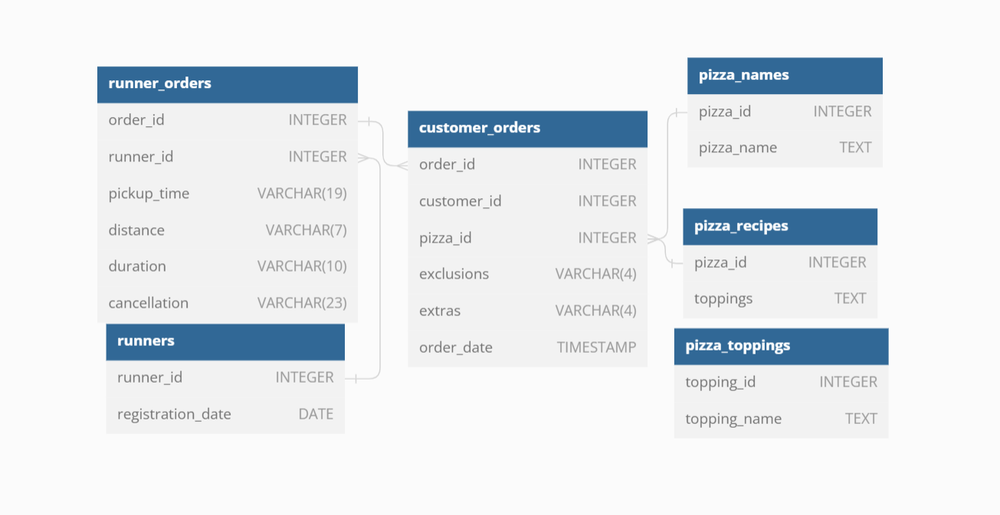

# **Case Study #2 - Pizza Runner**
------ 
 Luís Linhares 
 27/10/2022 
 MS SQL server 
 [Pizza Runner Link](https://8weeksqlchallenge.com/case-study-2/)  

-----
## DESCRIPTION
## Introduction
This case study has been divided as follow:
- A. Pizza Metrics
- B. Runner and Customer Experience
- C. Ingredient Optimisation
- D. Pricing and Ratings
- Bonus DML Challenges (DML = Data Manipulation Language)

## Problem Statement
We have the following tables available:
- runners
- runner_orders
- customer_orders
- pizza_name
- pizza_recipe
- pizza_toppings

You can inspect the entity relationship diagram and example data below.

 

----------------------------------------------------------------------

  
A.Pizza Metrics 

  ### Questions
  1. How many pizzas were ordered?
  2. How many unique customer orders were made?
  3. How many successful orders were delivered by each runner?
  4. How many of each type of pizza was delivered?
  5. How many Vegetarian and Meatlovers were ordered by each customer?
  6. What was the maximum number of pizzas delivered in a single order?
  7. For each customer, how many delivered pizzas had at least 1 change and how many had no changes?
  8. How many pizzas were delivered that had both exclusions and extras?
  9. What was the total volume of pizzas ordered for each hour of the day?
  10. What was the volume of orders for each day of the week? 

  [SOLUTION](A_Pizza_Metric.md)  
  [PROPOSED_SOLUTION_SQL](SQL/A_PizzaMetrics.sql) 
  Tableau [Link](https://public.tableau.com/views/pizzarunner/PizzaMetrics?:language=en-US&publish=yes&:display_count=n&:origin=viz_share_link)

  
B. Runner and Customer Experience 

  ### Questions
  1. How many runners signed up for each 1 week period? (i.e. week starts 2021-01-01)
  2. What was the average time in minutes it took for each runner to arrive at the Pizza Runner HQ to pickup the order?
  3. Is there any relationship between the number of pizzas and how long the order takes to prepare?
  4. What was the average distance travelled for each customer?
  5. What was the difference between the longest and shortest delivery times for all orders?
  6. What was the average speed for each runner for each delivery and do you notice any trend for these values?
  7. What is the successful delivery percentage for each runner?

[PROPOSED_SOLUTION](https://github.com/linhares-luis/Data-Study/blob/31962afc39ad942b6137bea36a02b3c8b32b91d1/8-weeks-SQL-challenge/Case-Study%232/B_Runner.md)
